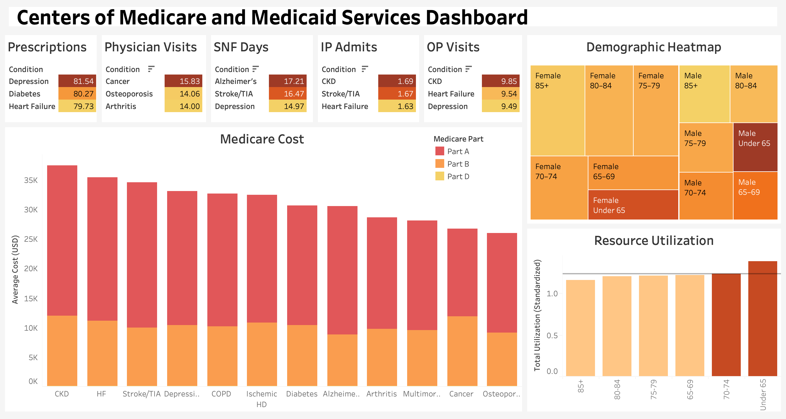

# Medicare Cost & Utilization Analysis  
**Predicting Medicare Costs & Identifying Utilization Trends in Chronic Care**

---

## 1. Project Overview

This project explores how chronic conditions, demographics, and healthcare utilization affect Medicare spending. Using CMS patient-level data, I developed a machine learning model to predict total Medicare cost per patient and used Tableau visualizations to surface key cost and service trends across age groups and disease types.

**Key Highlights:**
- Achieved **0.93 R²** in predicting Medicare costs using Random Forest
- Identified that **physician visits**, **inpatient admits**, and **prescription fills** are the strongest predictors of cost
- Built 5+ visuals to show cost and utilization patterns by conditon, demographic and Medicare part
- Generated actionable business insights to guide healthcare payers and providers

---

## 2. Concept Overview

This project applies fundamental healthcare analytics and machine learning concepts:

- **Regression Modeling (Random Forest, Linear Regression)**: To predict total annual Medicare cost
- **Feature Importance**: Understand what drives costs (utilization vs. condition vs. demographic)
- **Data Visualization**: Tableau and Seaborn for communicating trends
- **Healthcare Domain Insight**: Medicare Part A/B/D, chronic care, and utilization management

---

### Business Objective

High-cost Medicare patients place significant burden on healthcare systems. Payers and providers need tools to:

- Predict which patients are likely to become high-cost
- Identify utilization trends that drive cost
- Prioritize patients for case management or targeted interventions

This project simulates how health plans or accountable care organizations might use analytics to:
- Reduce preventable hospitalizations
- Design outreach for high-utilization segments
- Align reimbursement and care programs with real-world needs

---

## 3. Data Overview & Preparation

**Data Source:**  
CMS Chronic Conditions Summary (2010) – includes anonymized patient-level cost and utilization data

**Variables Used:**
- Demographics: Gender, Age Group
- Chronic Conditions: Diabetes, CHF, Alzheimer’s, Stroke, etc. (binary flags)
- Utilization Metrics: Inpatient, SNF, OP, Physician Visits, Rx Fills
- Cost Metrics: Part A, Part B (carrier & outpatient), Part D

**Preprocessing Steps:**
- Created `Total_Cost` = Part A + B + D
- Created `Total_Utilization` = Sum of all service volumes
- Filled missing condition & usage values with 0
- Applied `log1p()` transformation to stabilize `Total_Cost`
- Split into training/testing sets (80/20)

---

## 4. Application

**Tools Used:**
- **Python**: Pandas, Scikit-learn, Seaborn
- **SQL**: For filtering, transformations, and exports
- **Tableau**: For dashboard and data storytelling

**Modeling Summary:**
- Built baseline Linear Regression and tuned Random Forest models
- Evaluated using R², MAE, and RMSE
- Final model trained on 14 features (demographics + conditions + utilization)

**Notebook & Code Files:**
- `CMS_ML.ipynb`: Python modeling workflow
- `CMS_Project.sql`: SQL queries for data shaping
- `visuals/`: Tableau and Python images

---

## 5. Analyzing the Results

### ML Model Results

| Metric | Linear Regression | Random Forest |
|--------|-------------------|----------------|
| R² | 0.87 | **0.93** |
| MAE | 0.14 | **0.09** |
| RMSE | 0.20 | **0.14** |

> **Top Predictors**: Physician Visits (Part B), Inpatient Admits (Part A), Rx Fills (Part D)

---
### Dashboard Snapshot

### Tableau Visual Insights

| Visualization | Description | Insight |
|---------------|-------------|---------|
| Stacked Bar: Cost by Condition + Medicare Part | Conditions vs. Part A/B/D | **CKD, HF, and Stroke/TIA** have highest overall Medicare costs. **Part D** doesn't significantly contribute to total Medicare cost |
| Heatmap: Age × Gender | Total cost by demo group | Highest patient count is **Women >85** and **Men <65** are the most expensive |
| Utilization by Age Group | Standardized total usage | **Under 65** shows highest cost and usage |
| 5 Heatmaps: Top 3 Conditions by Utilization Metric | SNF, OP, Rx, IP, Physician Visits | Physician Visits: Cancer, SNF: Alzheimer’s, IP: CKD, OP: Diabetes, Rx: Depression |
| Scatterplot (not in dashboard): Total Utilization vs Total Cost | Trend line showing cost correlation | **Cost rises with utilization**, but with variation and outliers |

---

## 6. Real-World Value & Recommendations

The findings provide direct value for insurers, providers, and policy makers.

**Use Cases:**
-	Use model predictions to proactively flag high-cost patients for budget forecasting and early intervention. Adjust reimbursement rates based on condition-specific risk.
- Deploy care teams to patients predicted to exceed cost thresholds. Tailor strategies based on predicted utilization type (e.g., SNF-heavy vs OP-heavy).
- Policy makers can design better chronic care programs targeting utilization patterns

**Recommendations:**
- Introduce condition-specific case management for CKD patients, as the analysis identified CKD as the highest cost for Part A and B, along with the greatest IP Admits and OP visits. 
- Monitor high-frequency physician visit patients (e.g., Cancer patients), since the model shows these visits are the strongest predictors of rising Medicare costs; flagging them early can guide preventive care planning.
- Use the model to flag patients predicted to exceed a cost threshold (e.g., $10,000/year) and enroll them into targeted care plans, such as case management or preventive services, to help reduce unnecessary hospital visits and lower overall costs.
- Monitor outlier groups with **low utilization but high cost** (e.g., specialty drug users)

---

## 7. Growth & Next Steps

With more time or data, I would:

- Include multi-year CMS data to track patient cost over time
- Examine why men under 65 have the highest medicare cost
- Add social risk indicators
- Explore SHAP values for interpretability and model transparency
- Cluster patients into segments based on usage and cost profiles

---

## Repository Overview

| File/Folder | Description |
|-------------|-------------|
| `notebooks/` | Python notebooks with full modeling workflow |
| `sql/` | SQL scripts used for preprocessing |
| `visuals/` | Tableau and Python figures |
| `data/` | Raw CSV data |

---
